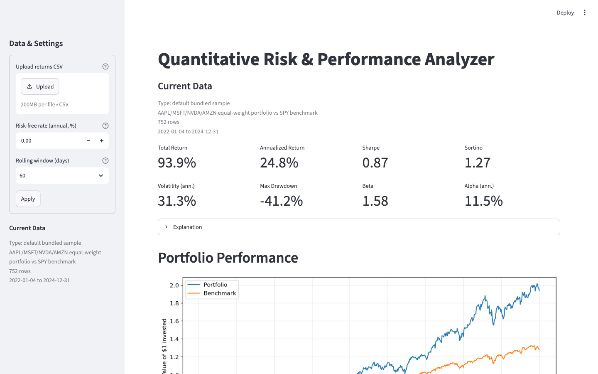
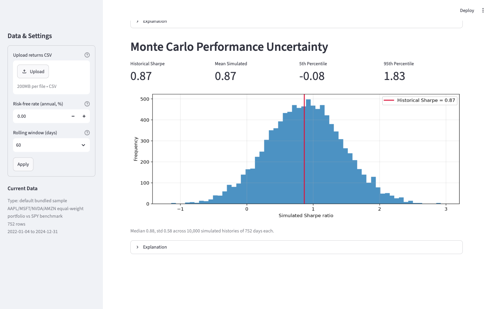

# Quantitative Risk & Performance Analyzer

A small, fully hand-rolled quantitative finance tool: upload a CSV of daily
portfolio and benchmark returns and get performance, risk, benchmark-exposure,
and Monte Carlo Sharpe-uncertainty analysis in a Streamlit dashboard.

Every formula (CAGR, volatility, Sharpe, Sortino, drawdown, CAPM beta/alpha/R²,
the Monte Carlo simulation) is implemented explicitly in numpy/pandas —
scipy appears only in the test suite as an independent cross-check.





## Run it

```bash
uv venv .venv
uv pip install -r requirements.txt
.venv/bin/streamlit run app.py
```

The dashboard opens preloaded with the bundled real sample
(AAPL/MSFT/NVDA/AMZN equal-weight vs SPY, 2022–2024). Upload your own CSV to
replace it.

## Input format

| column | meaning |
|---|---|
| `date` | one trading day per row |
| `portfolio_return` | daily return as a decimal (0.0021 = 0.21%) |
| `benchmark_return` | daily benchmark return as a decimal |

At least 60 rows. The loader sorts unordered rows, drops incomplete rows with
a warning, warns when values look like percentages, and rejects duplicate or
unparseable dates.

## Tests

```bash
uv pip install -r requirements-dev.txt
.venv/bin/pytest
```

Three layers: hand-computed known answers, scipy/pandas referee cross-checks,
and behavioral/edge tests (including an end-to-end check that the pipeline
recovers the synthetic sample's known beta and alpha).

## Sample data provenance

- `data/sample_synthetic.csv` — generated by `data/generate_synthetic.py`
  (seeded; known ground truth: beta 1.3, alpha 2%/yr, R² 0.75).
- `data/sample_real.csv` — produced once by `data/fetch_real.py` (yfinance,
  not a dependency) and committed as a static file.

## Project layout

```
app.py            Streamlit UI (no math)
src/              pure analysis modules: data_loader, returns, risk,
                  benchmark, monte_carlo, plots
tests/            pytest suite
data/             bundled samples + provenance scripts
docs/concepts.md  interview study guide for every formula used
```

## Conventions

Returns are decimals; every std is sample std (ddof=1); annualization uses 252
trading days; risk-free rate converts as rf/252; ratios with zero denominators
report NaN, never inf. Full details: `docs/superpowers/specs/`.

## Intentionally out of scope

Strategy backtesting, live data, portfolio optimization, factor models, GARCH,
VaR systems — this project is deliberately small; see the design spec.
