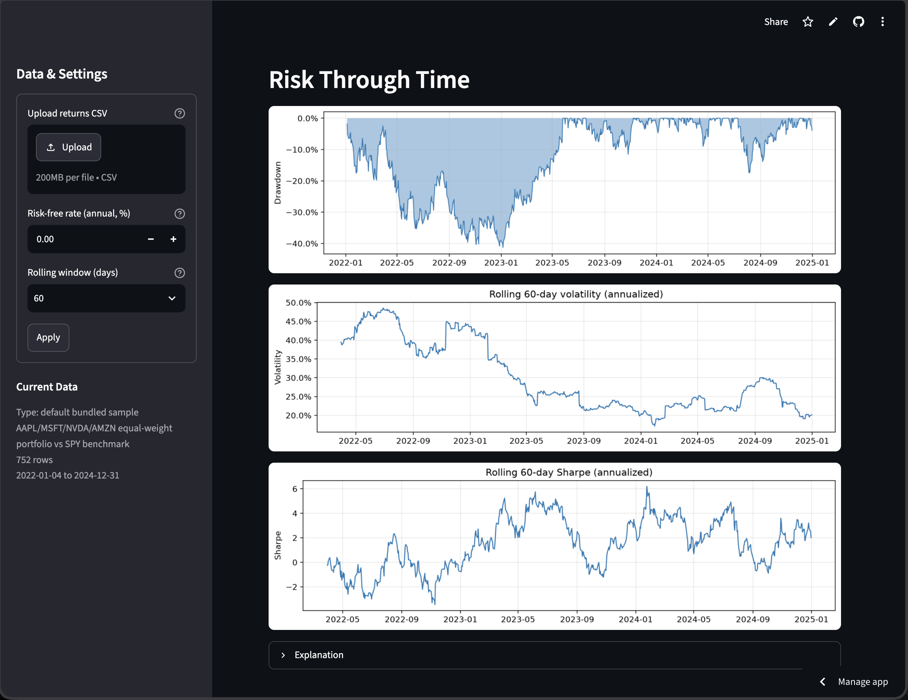
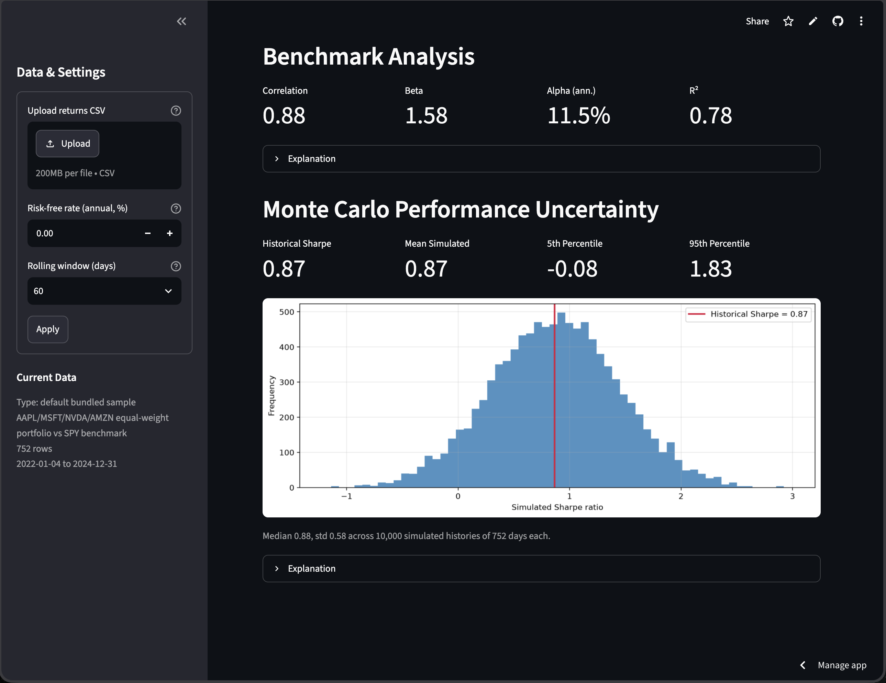

# Quantitative Risk & Performance Analyzer

A fully hand-rolled quantitative finance tool: upload a CSV of daily portfolio
and benchmark returns and get a complete risk and performance report — how the
portfolio grew, how much risk it took along the way, how much of the result is
explained by market exposure, and how much confidence the headline numbers
actually deserve — in an interactive Streamlit dashboard.

Every formula (CAGR, volatility, Sharpe, Sortino, drawdown, CAPM beta/alpha/R²,
the Monte Carlo simulation) is implemented explicitly in numpy/pandas rather
than imported from a finance library — scipy appears only in the test suite as
an independent cross-check. Each dashboard section carries an expander
explaining the math it displays, and the app opens preloaded with a real
three-year sample (an AAPL/MSFT/NVDA/AMZN equal-weight portfolio against SPY,
2022–2024), so everything in the screenshots below is live output.

**[▶ Try the live demo](https://rfukuda06-quant-risk-app-r2epvs.streamlit.app/)** — no setup required.






## Key components

The dashboard is ordered as a chain of questions, each section answering
something the previous one cannot.

**1. Summary metrics — the headline numbers.**
Two rows of at-a-glance figures: total and annualized (CAGR) return, Sharpe,
Sortino, annualized volatility, max drawdown, beta, and alpha. Everything here
is recomputed live from the loaded returns; the sections below unpack where
each number comes from and what it can and cannot tell you.

**2. Portfolio performance — did it make money?**
The equity curve compounds daily returns into the growth of $1 invested
(Vₜ = Vₜ₋₁(1 + rₜ)) for the portfolio and the benchmark side by side, with
best-day / worst-day callouts. Compounding — the product of returns, not the
sum — is the whole story here. But a return figure alone says nothing about
how much risk was taken to earn it, which is the next section's job.

**3. Risk through time — what did the ride look like?**
Volatility summarizes the typical size of daily moves, but two portfolios with
identical volatility can have very different worst losses — so the drawdown
chart tracks realized peak-to-trough losses through time. The rolling
volatility and rolling Sharpe charts then recompute both inside a moving
window, showing that neither risk nor risk-adjusted performance is constant.
Knowing the risk still doesn't say whether the returns were earned by the
strategy or simply borrowed from market exposure.

**4. Benchmark analysis — skill or just market exposure?**
A hand-rolled CAPM regression decomposes portfolio returns against the
benchmark: correlation measures direction of co-movement, beta measures how
hard the portfolio leans on benchmark moves, R² measures how much of the
variance the benchmark explains, and alpha is what's left over — the average
return market exposure cannot account for. Alpha is an estimate with sampling
error, not proof of skill — which raises the final question.

**5. Monte Carlo — how much should you trust these numbers?**
The measured Sharpe ratio is one draw from a sampling distribution. This
section fits Normal(μ̂, σ̂²) to the observed returns, simulates 10,000
alternate histories of the same length, computes each one's Sharpe with the
exact same formula, and plots the spread: on the bundled three-year sample the
simulated Sharpes have a standard deviation of about 0.58. That is the
project's closing point — headline risk-adjusted numbers carry real
statistical uncertainty even with years of daily data.

Upstream of all five sections sits a strict validation layer: every CSV is
checked for required columns, parseable and unique dates, numeric
decimal-scale values, and a 60-row minimum before any metric is computed, with
warnings for suspect data (percent-scale values, >50% daily moves).

## Input format

| column | meaning |
|---|---|
| `date` | one trading day per row |
| `portfolio_return` | daily return as a decimal (0.0021 = 0.21%) |
| `benchmark_return` | daily benchmark return as a decimal |

At least 60 rows. The loader sorts unordered rows, drops incomplete rows with
a warning, warns when values look like percentages, and rejects duplicate or
unparseable dates.

## Tests

```bash
uv pip install -r requirements-dev.txt
.venv/bin/pytest
```

Three layers: hand-computed known answers, scipy/pandas referee cross-checks,
and behavioral/edge tests (including an end-to-end check that the pipeline
recovers the synthetic sample's known beta and alpha).

## Sample data provenance

- `data/sample_synthetic.csv` — generated by `data/generate_synthetic.py`
  (seeded; known ground truth: beta 1.3, alpha 2%/yr, R² 0.75).
- `data/sample_real.csv` — produced once by `data/fetch_real.py` (yfinance,
  not a dependency) and committed as a static file.

## Conventions

Returns are decimals; every std is sample std (ddof=1); annualization uses 252
trading days; risk-free rate converts as rf/252; ratios with zero denominators
report NaN, never inf. Full details: `docs/superpowers/specs/`.

## Run it locally

The [live demo](https://rfukuda06-quant-risk-app-r2epvs.streamlit.app/) above
needs no setup. To run the app on your own machine instead:

```bash
uv venv .venv
uv pip install -r requirements.txt
.venv/bin/streamlit run app.py
```

The dashboard opens preloaded with the bundled real sample
(AAPL/MSFT/NVDA/AMZN equal-weight vs SPY, 2022–2024). Upload your own CSV to
replace it.
